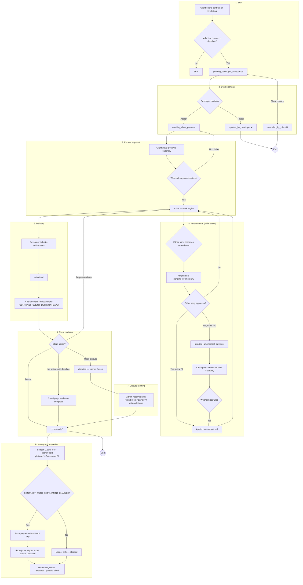
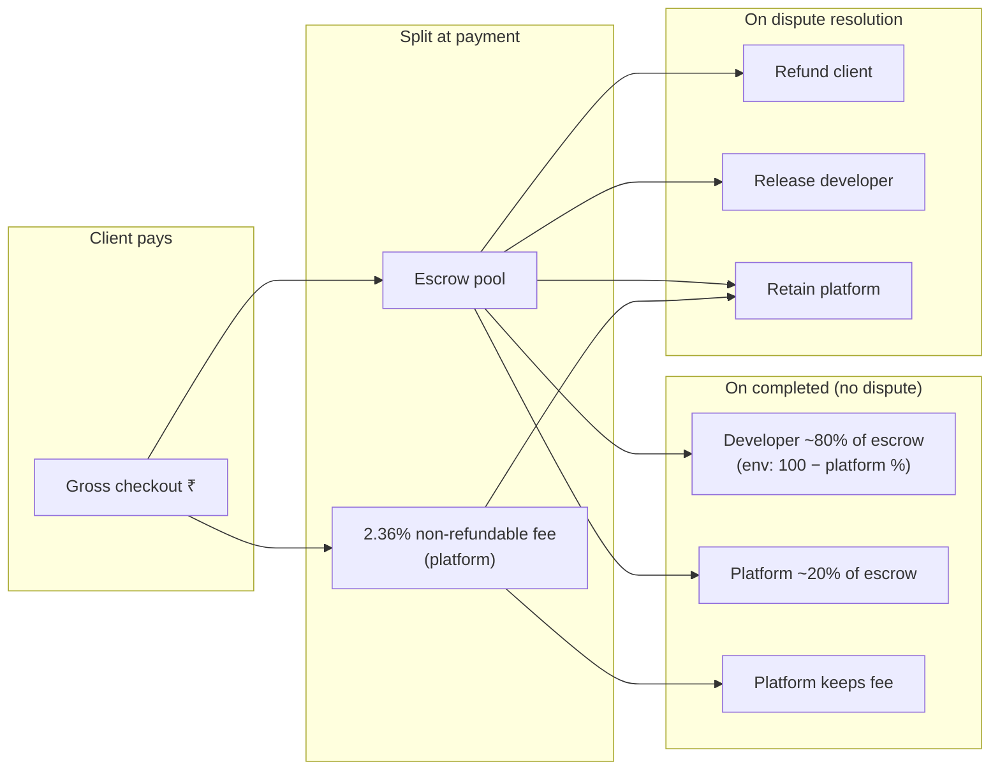
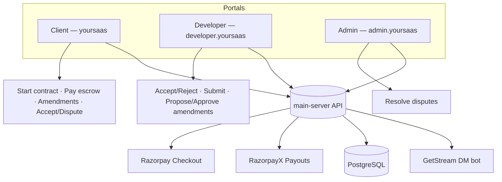
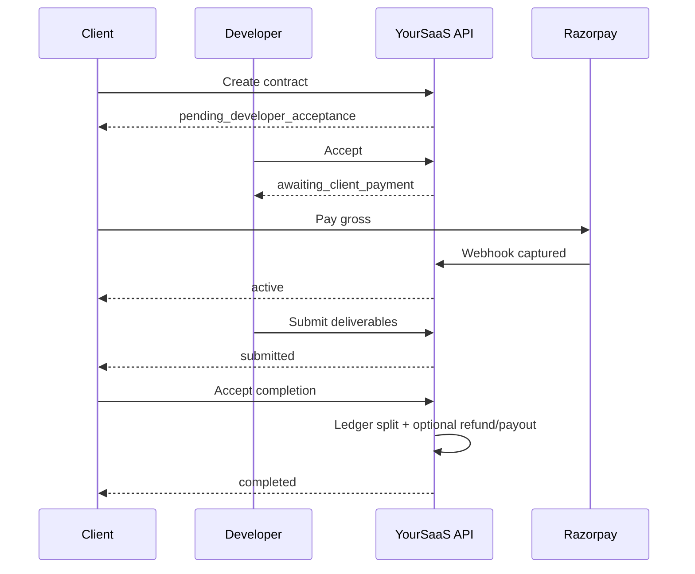

# Marketplace contract flow

End-to-end lifecycle for escrow-style contracts between a **client** and **developer** on a live listing. Money math: **2.36%** non-refundable fee on gross; escrow split on completion via `CONTRACT_PLATFORM_COMMISSION_PERCENT` (default **20%** platform / **80%** developer of escrow).

**Code:** `src/services/contract.service.ts`, `src/services/contract-settlement.service.ts`, `src/jobs/contract-jobs.ts`

**Portals:** Client (`yoursaas`), Developer (`developer.yoursaas`), Admin disputes (`admin.yoursaas` → `/dashboard/disputes`)

---

## Main lifecycle

---

## Status cheat sheet

| Status | Who acts next |
|--------|----------------|
| `pending_developer_acceptance` | Developer accept/reject · client can cancel |
| `awaiting_client_payment` | Client pays escrow |
| `active` | Developer works · either side can propose amendments |
| `awaiting_amendment_payment` | Client pays approved amendment top-up |
| `submitted` | Client accept / revision / dispute · or auto-complete |
| `disputed` | Admin resolves |
| `completed` | Done — settlement runs |
| `rejected_by_developer` / `cancelled_by_client` | Closed |

All statuses are defined in `ContractStatus` in `src/services/contract.service.ts`.

---

## Money flow (successful completion)

---

## Portals and integrations

---

## Happy path (sequence)

---

## API routes (reference)

| Role | Base path | Notable endpoints |
|------|-----------|-------------------|
| Client | `/api/user/contracts` | `POST /`, `POST /:id/pay-escrow`, `POST /:id/amendments`, `POST /:id/accept-completion`, `POST /:id/open-dispute` |
| Developer | `/api/developer/contracts` | `POST /:id/accept`, `POST /:id/reject`, `POST /:id/submit`, `POST /:id/amendments` |
| Admin | `/api/admin/contracts` | `GET /disputes`, `POST /disputes/:id/resolve` |
| Webhook | `/api/developer/payment/webhook/razorpay` | `payment.captured` → activate contract / apply amendment |

Public pricing preview: `GET /api/public/products/by-id/:id/contract-pricing`

---

## Environment variables

| Variable | Default | Purpose |
|----------|---------|---------|
| `CONTRACT_PLATFORM_COMMISSION_PERCENT` | `20` | Platform % of **escrow** on success |
| `CONTRACT_CLIENT_DECISION_DAYS` | `14` | Days after submit before auto-complete |
| `CONTRACT_AUTO_COMPLETE_INTERVAL_MS` | `300000` | Background job interval (5 min) |
| `CONTRACT_AUTO_SETTLEMENT_ENABLED` | `false` | Razorpay refunds + RazorpayX payouts after settlement |
| `RAZORPAY_*` | — | Checkout + webhooks |
| `RAZORPAYX_SOURCE_ACCOUNT_NUMBER` | — | Payouts + bank validation |

See `.env.example` for full list.

---

## Production checklist

1. Set `CONTRACT_AUTO_SETTLEMENT_ENABLED=true` when live keys and RazorpayX are ready.
2. Configure Razorpay webhook → `payment.captured` (and monitor payout/refund events).
3. Developers must complete **payout bank verification** before payouts succeed.
4. Ensure CORS includes client, developer, and admin portal origins.
5. GetStream: buyer–seller DM must exist for contract bot messages.

---

## Related files

| Area | Path |
|------|------|
| Core service | `src/services/contract.service.ts` |
| Settlement | `src/services/contract-settlement.service.ts` |
| Payouts | `src/services/razorpay-x-payout.service.ts` |
| Payments | `src/services/payment.service.ts` |
| Auto-complete job | `src/jobs/contract-jobs.ts` |
| Schema / migration | `src/db/schema.ts`, `drizzle/0021_marketplace_contracts.sql`, `drizzle/0022_contract_settlement.sql` |
